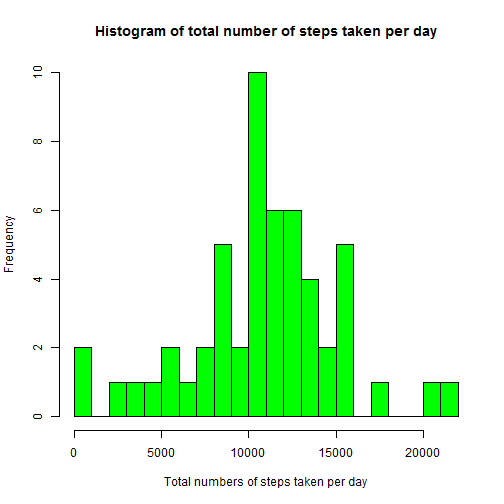
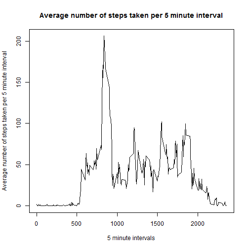
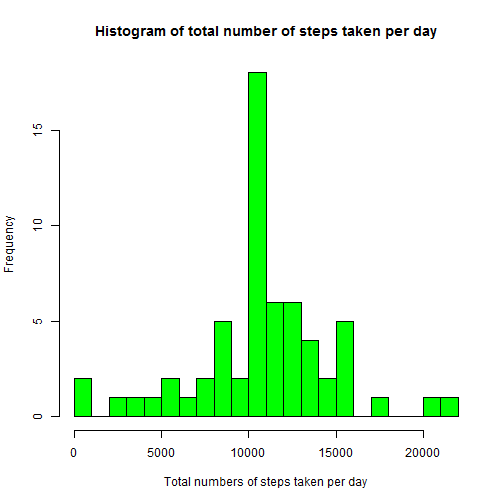
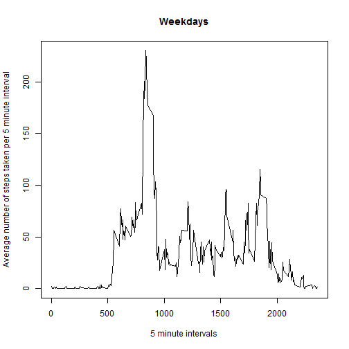
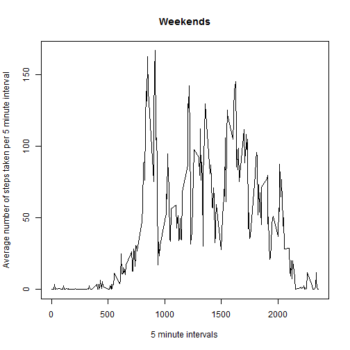

# Reproducible Research assigment 1

## Author: Rafael

## Date: February 5, 2016

### Output: html_document
        
First I loaded the data, removed NA values and converted the dates into proper R date format.
Bear in mind that this code assumes that you have already set a working directory for R and the dataset is located in this working directory.


```r
activity_data <- read.csv("activity.csv", stringsAsFactors = FALSE) # reading in data

activity_data[,2] <- as.Date(activity_data[,2]) # converting into proper date format

y <- activity_data[is.na(activity_data[,1]) == FALSE,] # removing NA values
```

### What is mean total number of steps taken per day?


Now I calculated the total number of steps taken per day.

I also plotted a histogram of the total number of steps taken per day and report the mean and median number of steps taken per day

```r
sums <- aggregate(y["steps"], y["date"],sum) # calculating the total number of steps taken per day

hist(sums$steps, breaks = 30, xlab = "Total numbers of steps taken per day", main = "Histogram of total number of steps taken per day", col = "green") # making a histogram of the total number of steps taken each day
```

 

```r
mean(sums$steps) # calculating the mean number of steps taken per day
```

```
## [1] 10766.19
```

```r
median(sums$steps) # calculating the median number of steps taken per day
```

```
## [1] 10765
```

### What is the average daily activity pattern?


I made a time series plot of the 5 minute intervals and the average number of steps, averaged across all days.  I also reported which 5 minute interval contained the maximum number of steps.


```r
interval_means <- aggregate(y["steps"], y["interval"], mean) # average number of steps taken per 5-minute interval, averaged across all days

plot(x = interval_means$interval, y = interval_means$steps, type = "l", xlab = "5 minute intervals", ylab = "Average number of steps taken per 5 minute interval", main = "Average number of steps taken per 5 minute interval") # time series plot of the 5-minute intervals and the average number of steps taken, averaged across all days
```

 

```r
interval_means[which.max(interval_means[,2]) , 1] # this five minute interval contained the maximum number of steps
```

```
## [1] 835
```


### Imputing missing values


Now I calculated the numbers of missing values (NA values) and devised a strategy to replace them.
My strategy was to replace the NA values by the mean of the 5-minute intervals


```r
sum(is.na(activity_data$steps)) # reporting number of NA values
```

```
## [1] 2304
```

```r
#interval_means[which.maactivity_data(interval_means$steps),]

new_data_set <- merge(activity_data,interval_means, by = "interval") # merging acitivity_data with interval means in order to replace NA values with mean of 5 minute intervals

new_data_set[is.na(new_data_set[,2]),2] <- new_data_set[is.na(new_data_set[,2]),4] # finally removing NA values

new_data_set <- new_data_set[order(new_data_set$interval, new_data_set$date),] # ordering data by date (earlier dates come first)

new_data_set <- new_data_set[,c(2,3,1)] # removing fourth column since it is not needed anymore

colnames(new_data_set) <- colnames(activity_data) # adding column names

sum_of_steps <- aggregate(new_data_set["steps"], new_data_set["date"],sum) # calculating new sum of numbers of steps now that NA values have been replaced by 5 minute averages

mean(sum_of_steps$steps) # reporting the mean number of steps in this new data set
```

```
## [1] 10766.19
```

```r
median(sum_of_steps$steps) # reporting the median number of steps in this new data set
```

```
## [1] 10766.19
```

The mean and the median are now equal although they aren't very different from what was calculated when the NA values were just removed from the data set.


```r
hist(x = sum_of_steps$steps, breaks = 30, xlab = "Total numbers of steps taken per day", main = "Histogram of total number of steps taken per day", col = "green") # plotting histogram
```

 

We can see from that the shape of the histogram is not very different using this new data set although the scale of the y axis has become wider

### Are there differences in activity patterns between weekdays and weekends? 


For this part of the assignment I created a new factor variable with two levels - 'weekday" and "weekend" indicating whether a given date was a weekday or weekend day.

I then made two panel plots containing a time series plot of the 5 minute interval and the average number of steps taken, averaged across all weekday days and weekend days (I made a plot for both).


```r
new_data_set[,4] <-  NA # adding an extra column to new data set

new_data_set[weekdays(new_data_set$date) %in% c("Saturday", "Sunday"),4] = "weekend" # adding which days are weekends

new_data_set[is.na(new_data_set[,4]),4] <- "weekday" # from the logic I used above, all NA values will be weekdays now

new_data_set[,4] <- as.factor(new_data_set[,4]) # converting column class from character to factor

colnames(new_data_set)[4] <- "weekdays" # adding a name to fourth column


u = aggregate(new_data_set["steps"], new_data_set[c("interval","weekdays")], mean) # calculating the mean numbers of step averaged across weedays and weekends
```

Plot of weekdays:


```r
plot(x = u[u$weekdays == "weekday",1], y = u[u$weekdays == "weekday",3], type = "l", xlab = "5 minute intervals", ylab = "Average number of steps taken per 5 minute interval", main = "Weekdays") # plot of weekdays
```

 

Plot of weekends:


```r
plot(x = u[u$weekdays == "weekend",1], y = u[u$weekdays == "weekend",3], type = "l", xlab = "5 minute intervals", ylab = "Average number of steps taken per 5 minute interval", main = "Weekends") # plot of weekends
```

 
